# 数据链路层

## 数据链路层概述

- **链路**(Link)就是从一个结点到相邻结点的一段物理线路而中间没有任何其他的交换结点。
- **数据链路**（Data Link)是指把实现通信协议的硬件和软件加到链路上，就构成了数据链路。
- 数据链路层以帧为单位传输和处理数据

数据链路层在网络体系结构中的地位
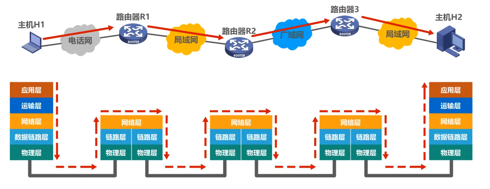

以太网帧格式

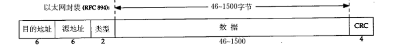

## 数据链路层的几个共同问题

- 数据链路层的三个重要问题(数据链路层三个基本问题是共同的)
  - 封装成帧
    - 就是在一段数据的前后分别添加 首部和尾部
    - 首部尾部的一个重要作用就是进行**帧定界**
    - 为了提高帧的传输效率，应当使帧的数据部分的长度尽可能大些。
    - 每一种链路层协议都规定了所能传送帧的**数据部分长度上限--最大传送单元**
  - 透明传输
    - 如果数据中的某个字节的二进制代码恰好和SOH或EOT这种控制字符一样（如图3-6所示），数据链路层就会错误地找到帧的边界”，把部分帧收下（误认为是个完整的帧），而把剩下的那部分数据丢弃。（这部分找不到帧定界控制字符SOH）。
        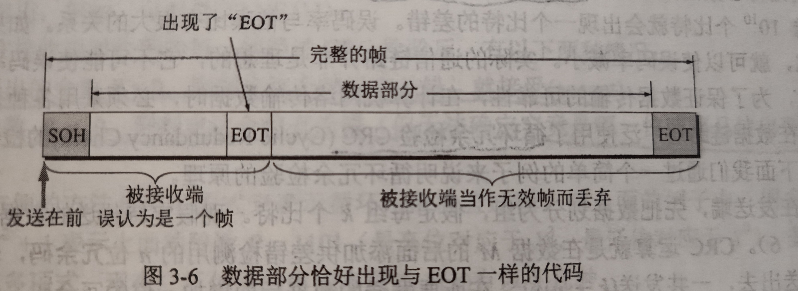
    - 透明传输是指数据链路层对上层交付的传输数据没有任何限制，就好像数据链路层不存在一样。
    - 解决方法: 在发送端的数据链路层中在数据出现控制字符`SHO`或`EOT`的前面插入一个被转义字符`ESC`。而在接收端的数据链路层在把数据送往网络层之前删除这个插入的转义字符.这种方法称为字节填充或字符填充。 如图3-7
        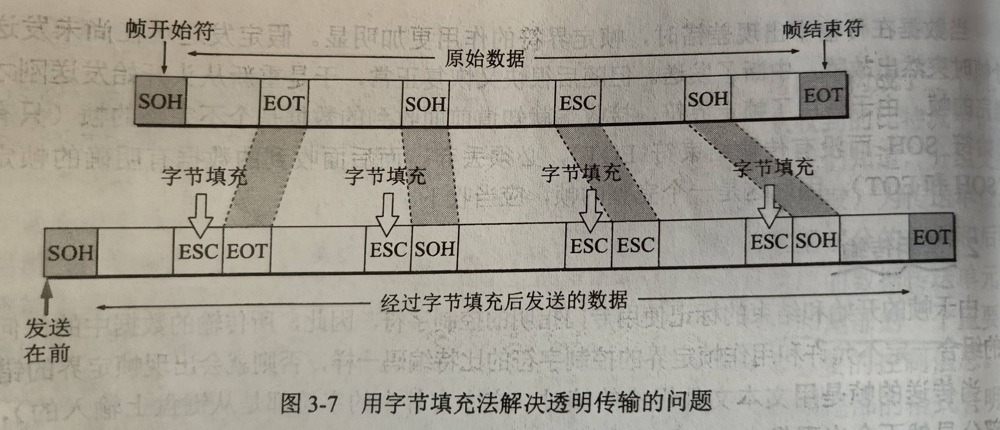
  - 差错检测
    - 实际的通信链路都不是理想的，比特在传输过程中可能会产生差错:1可能会变成0,而0也可能变成1。这称为**比特差错**。
    - 在一段时间内，传输错误的比特占所传输比特总数的比率称为**误码率BER**
    - 使用差错检测码来检测数据在传输过程中是否产生了比特差错，是数据链路层所要解决的重要问题之一。（循环冗余校验CRC）

- 循环冗余校验CRC
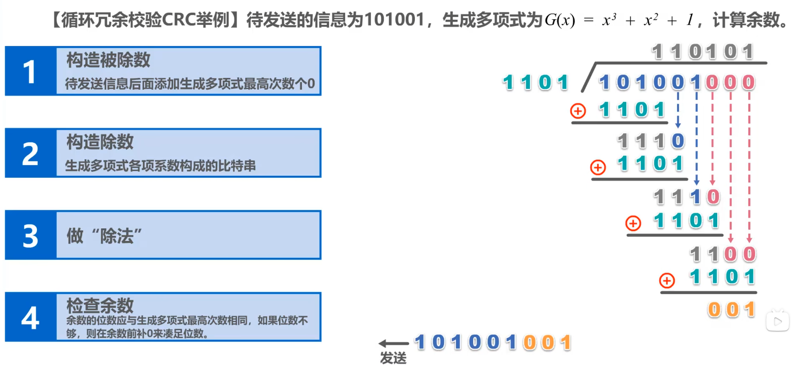

## 点对点协议 PPP

- ppp协议就是用户计算机和isp进行通信时所使用的数据链路层协议
- 点对点协议PPP(Point-to-Point Protocol)是目前使用最广泛的点对点数据链路层协议。
- ppp协议应满足的需求
  - 简单
  - 封装成帧
  - 透明性
  - 多种网络层协议
  - 多种类型链路
  - 差错检测
  - 检测连接状态
  - 最大传送单元
    - 网络层地址协商
    - 数据压缩协商
- ppp协议帧格式
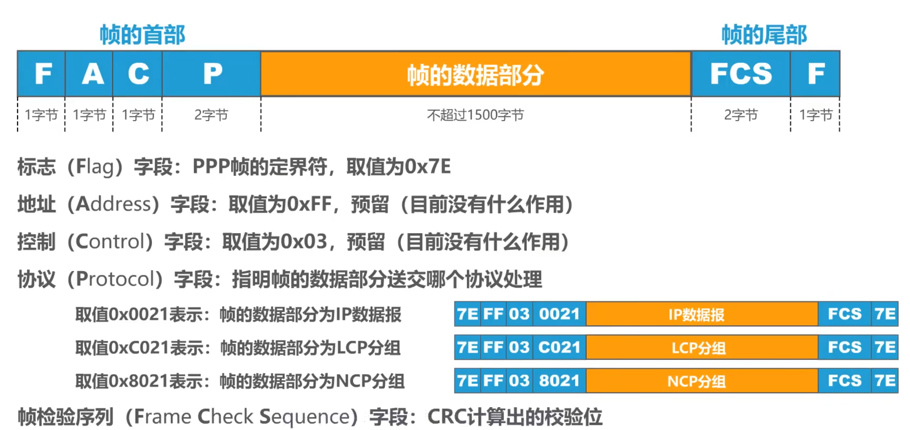
- 连续两帧之间只需要一个标志字段

### ppp协议的透明传输

- 面向字节的异步链路
  - 发送方：
        1. 出现的每一个7E (PPP帧的定界符)字节转变成2字节序列(7D,5E)。
        2. 出现的每一个7D(转义字符)字节转变成2字节序列(7D,5D)。
        3. 出现的每一个ASCII码控制字符（数值小于0x20的字符），则在该字符前面插入一个7D字节，同时将该字符的编码加上0x20。
        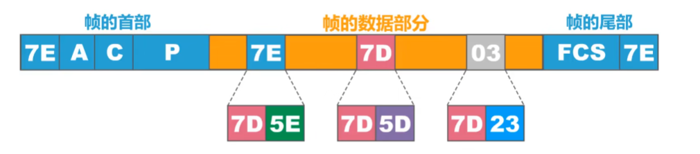
  - 接收方：
    - 进行反变换即可恢复出原来的帧的数据部分
- 面向比特的同步链路
  - 发送方：
    - 对帧的数据部分进行扫描（一般由硬件实现)。只要发现5个连续的比特1，则立即填充1个比特0。
  - 接收方：
    - 对帧的数据部分进行扫描（一般由硬件实现)。只要发现5个连续的比特1，就把其后的1个比特0删除

### ppp协议工作状态

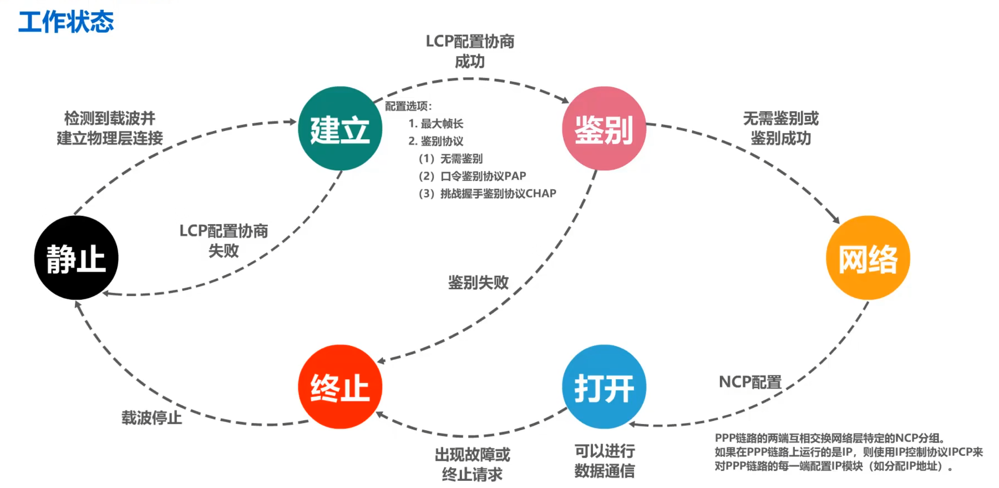

## 使用广播信道的数据链路层

- 共享信道要着重考虑的一个问题就是如何协调多个发送和接收站点对一个共享传输媒体的占用，即媒体接入控制MAC(Medium Access Control)。

### 媒体接入控制

- 静态划分信道 （预先固定分配好信道,这类方法非常不灵活，对于突发性数据传输信道利用率会很低。
通常在无线网络的物理层中使用，而不是在数据链路层中使用。
）
  - 频分多址
  - 时分多址
  - 码分多址

- 动态接入控制
  - **受控接入** （已被淘汰）
    - **集中接入**（有一个主站以循环方式轮询每个站点有无数据发送,只有被轮询到的站点才能发送数据。最大缺点是存在单点故障问题。）
    - **分散接入** （各站点是平等的,并连接成一个环形网络。令牌(一个特殊的控制帧)沿环逐站传递,接收到令牌的站点才有权发送数据,并在发送完数据后将令牌传递给下一个站点。）
  - **随机接入** （所有站点通过竞争，随机地在信道上发送数据。如果恰巧有两个或更多的站点在同一时刻发送数据，则信号在共享媒体上就要产生碰撞(即发生了冲突)。使得这些站点的发送都失败。因此，这类协议要解决的关键问题是如何尽量避免冲突及在发生冲突后如何尽快恢复通信。著名的共享式以太网采用的就是随机接入。）

#### 静态划分信道

- 信道复用
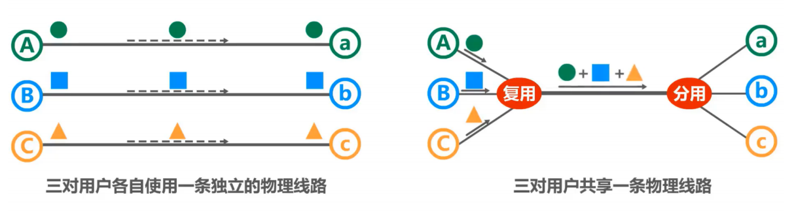
  - 复用(Multiplexing）是通信技术中的一个重要概念。复用就是通过一条物理线路同时传输多路用户的信号。
  - 当网络中传输媒体的传输容量大于多条单一信道传输的总通信量时，可利用复用技术在一条物理线路上建立多条通信信道来充分利用传输媒体的带宽。

- 频分复用FDM (Frequency Division Multiplexin)
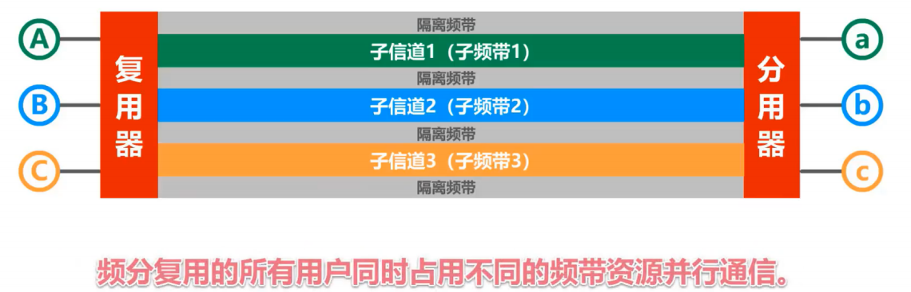
  - 将整个带宽分为多份，用户在分配到一定的频带后，在通信过程中自始至终都占用这个频带。
  - **频分复用**的所有用户在同样的时间占用不同的带宽资源（请注意，这里的“带宽”是频率带宽而不是数据的发送速率)。

- 时分复用TDM (Time Division Multiplexing)
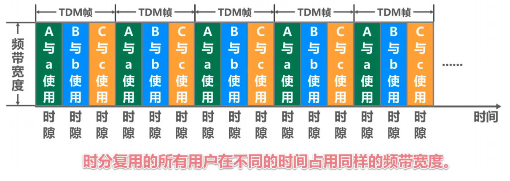
  - 时分复用则是将时间划分为一段段等长的时分复用帧（TDTDM 帧中占用固定序号的时隙。
  - 每一个用户所占用的时隙是周期性地出现（其周期就是TDM帧长度）的
  - TDM信号也称为等时 (isochronous) 信号。
  - 时分复用的所有用户在不同的时间占用同样的频带

- 波分复用 WDM(Wavelength Division Multiplexin)
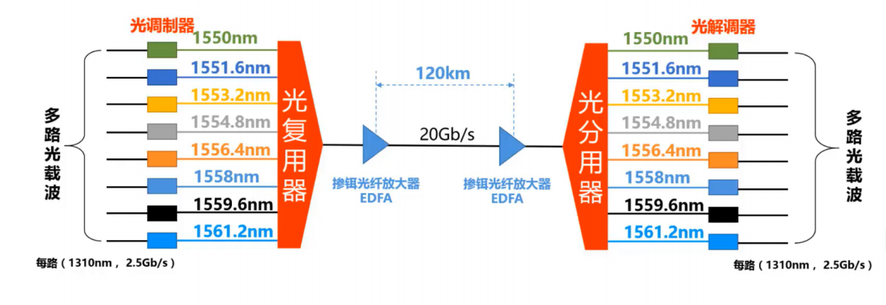
  - 波分复用就是光的频分复用，使用一根光纤来同时传输多个光载波信号
  - 光信号传输一段距离后会衰减，所以要用 掺铒光纤放大器 放大光信号

- 码分复用 CDM (Code Division Multiplexin)
  - 码分复用CDM是另一种共享信道的方法。实际上，由于该技术主要用于多址接入，人们更常用的名词是码分多址CDMA(Code Division Multiple Access)。
  - 同理，频分复用FDM和时分复用TDM同样可用于多址接入，相应的名词是频分多址FDMA(Freauency Division Multiple Access)和时分多址TDMA(Time Division Multiple Access).
  - 与FDM和TDM不同，CDM的每一个用户可以在同样的时间使用同样的频带进行通信。
  - 由于各用户使用经过特殊挑选的不同码型，因此各用户之间不会造成干扰。

### 动态接入控制

- CSMA/CD协议
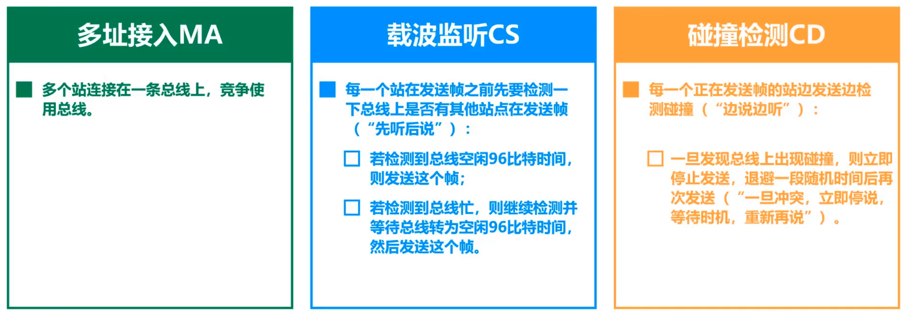
  - 多点接入：就是说明这是总线型网络，许多计算机以多点接入的方式连接到一根总线上
  - 载波监听：也就是边发送，边监听。我们知道，载波监听就是不管在想要发送数据之前，还是在发送数据之中，每个站都必须不停地检测信道。在发送前检测信道，是为了避免冲突。如果检测出已经有其他站在发送，则本站就暂时不要发送数据。在发送中检测信道，是为了及时发现如果有其他站也在发送，就立即中断本站的发送。这就称为碰撞检测。
  - 碰撞检测：
    
    - 主机最多经过2t的时长就可检测到本次发送是否遭受了碰撞
    - 因此，以太网的端到端往返传播时延2t称为争用期或碰撞窗口。
    - 经过争用期这段时间还没有检测到碰撞，才能肯定这次发送不会发生碰撞。
    - 每一个主机在自己发送帧之后的一小段时间内，存在着遭遇碰撞的可能性。这一小段时间是不确定的。它取决于另一个发送帧的主机到本主机的距离，但不会超过总线的端到端往返传播时延，即一个争用期时间。
    - 显然，在以太网中发送帧的主机越多，端到端往返传播时延越大，发生碰撞的概率就越大。因此，共寻式以太网不能连接太多的主机，使用的总线也不能太长。
    - 显然，在使用CSMA/CD协议时，不可能同时进行发送和接收
  - 以太网规定最小帧长为64字节，即512比特
    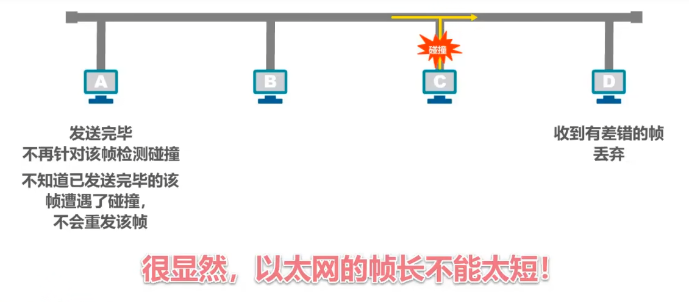
    - 单程端到端传播时延为t = 路程/速度
    - 争用期 = 2t.
    - 最小帧长为 **争用期(2t m/s)\*数据据传输数率(bit/s)**
  - 以太网规定最大帧
    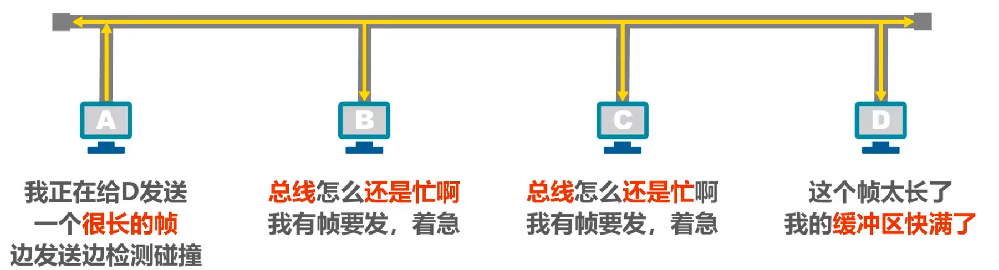
  - 截断二进制指数退避算法
    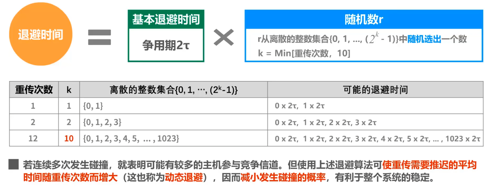
  - 信道利用率
    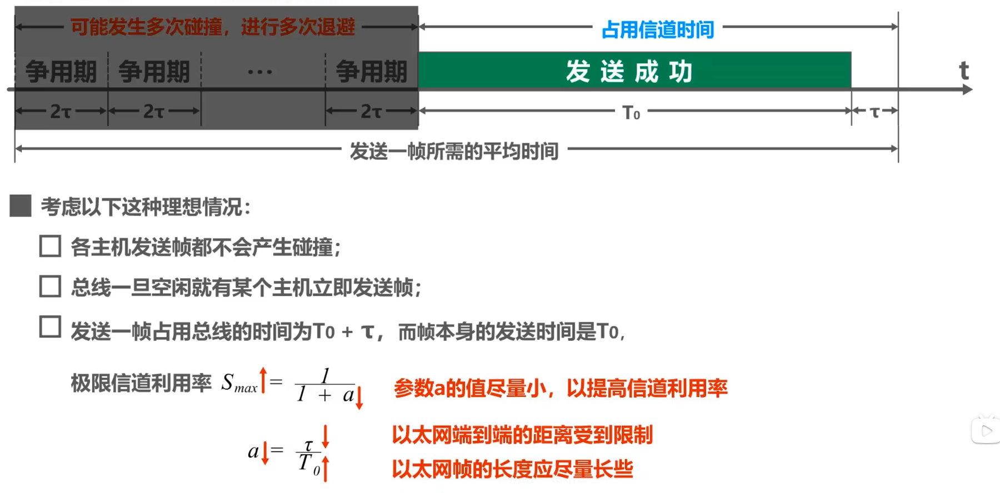
  - CSMA/CD 发送流程
    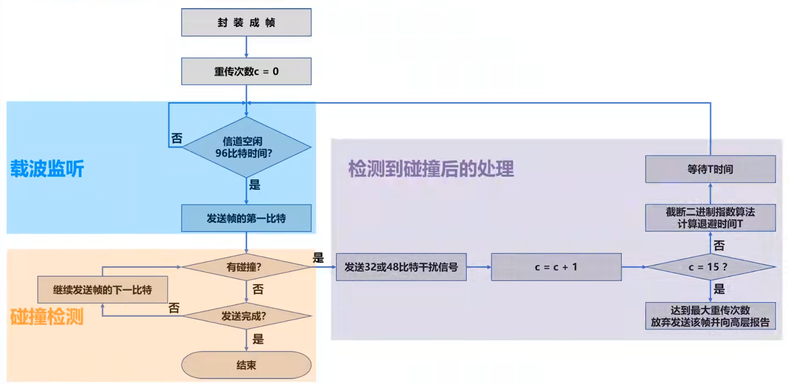
  - CSMA/CD 接收流程
    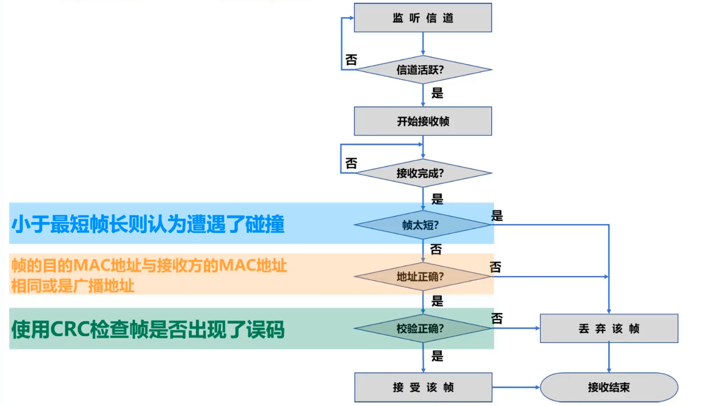

## 以太网的MAC层

### MAC地址，IP地址以及ARP协议

- MAC地址是以太网的MAC子层所使用的地址;（链路层）
- IP地址是TCP/IP体系结构网际层所使用的地址;（网络层）
- ARP协议属于TCP/IP体系结构的网际层，其作用是已知设备所分配到的IP地址，使用ARP协议可以通过该lIP地址获取到设备的MAC地址;
- 尽管IP地址和ARP协议属于TCP/IP体系结构的网际层（而不属于数据链路层)，但是它们与MAC地址存在一定的关系，并且我们日常的网络应用都离不开MAC地址、IP地址以及ARP协议。因此，我们将这三者放在一起讨论。

### MAC地址

- 当多个主机连接在同一个广播信道上，要想实现两个主机之间的通信，则每个主机都必须有一个唯一的标识,即一个数据链路层地址;
- 在每个主机发送的帧中必须携带标识发送主机和接收主机的地址。由于这类地址是用于媒体接入控制MAC(Media Access Control)，因此这类地址被称为MAC地址（硬件地址）;
- 一般情况下，用户主机会包含两个网络适配器:有线局域网适配器（有线网卡）和无线局域网适配器（无线网卡)。每个网络适配器都有一个全球唯一的MAC地址。而交换机和路由器往往拥有更多的网络接口，所以会拥有更多的MAC地址。综上所述，**严格来说，MAC地址是对网络上各接口的唯一标识，而不是对网络上各设备的唯一标识**。
- 单播，广播，多播
    1. 单播帧
    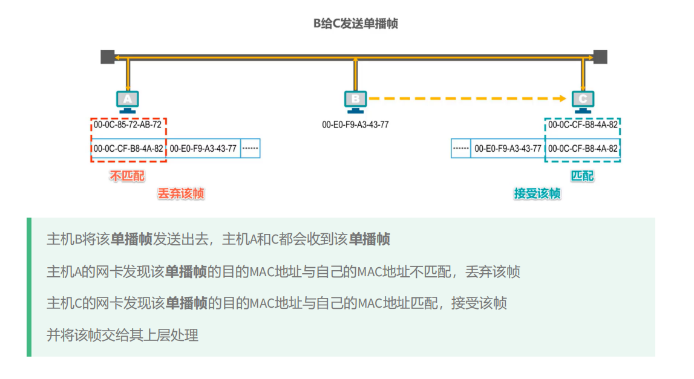
    2. 广播帧 （广播mac地址全为f）
    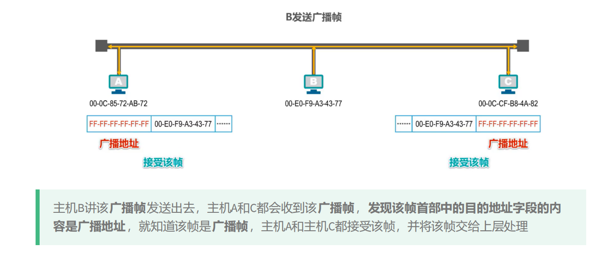
    3. 多播帧
    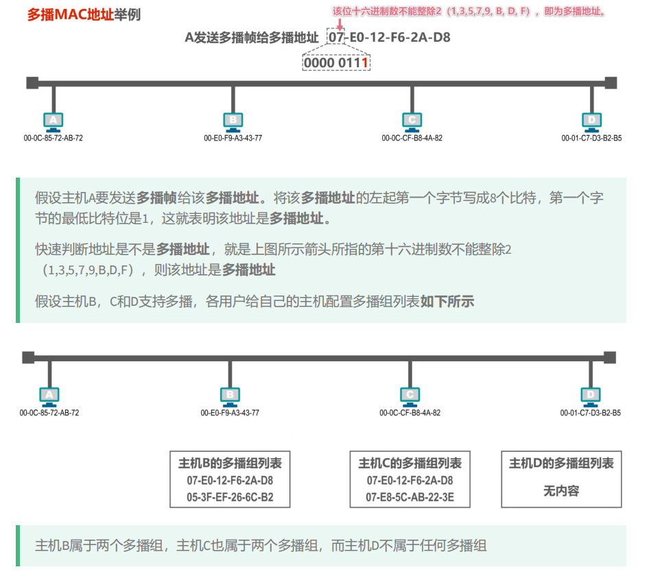
    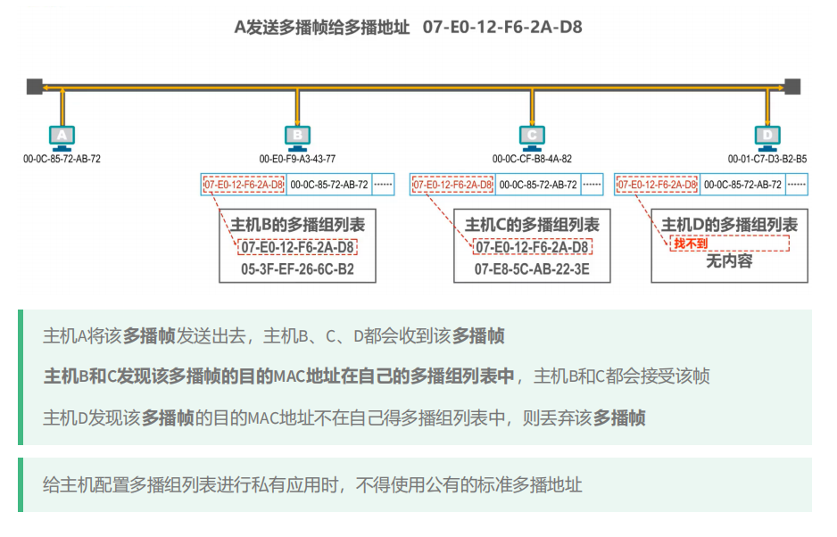

### 拓展的以太网

#### 集线器

##### 概念

- 传统以太网最初是使用粗同轴电缆，后来演进到使用比较便宜的细同轴电缆，最后发展为使用更便宜和更灵活的双绞线。
- 采用双绞线的以太网采用星形拓扑，在星形的中心则增加了一种可靠性非常高的设备，叫做集线器 (hub)。
- 集线器是也可以看做多口中继器，每个端口都可以成为一个中继器，中继器是对减弱的信进行放大和发送的设备
- 集线器的以太网在逻辑上仍是个总线网，需要使用CSMA/CD协议来协调各主机争用总线，只能工作在半双工模式，收发帧不能同时

##### 集线器HUB在物理层扩展以太网

- 使用集线器扩展：将多个以太网段连成更大的、多级星形结构的以太网
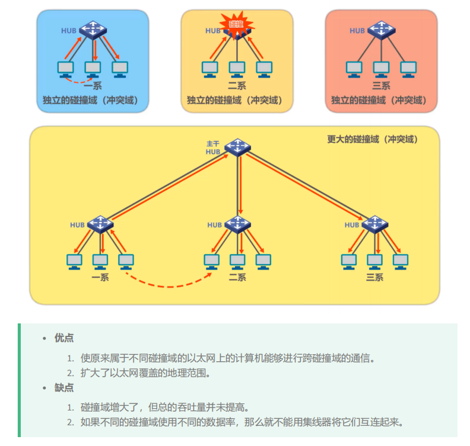

#### 以太网交换机

##### 概念

- 扩展以太网更常用的方法是在数据链路层进行
- 早期使用网桥，现在使用以太网交换
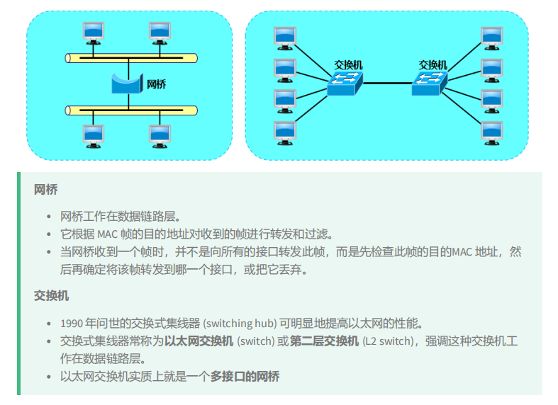

##### 集线器HUB与交换机SWITCH区别

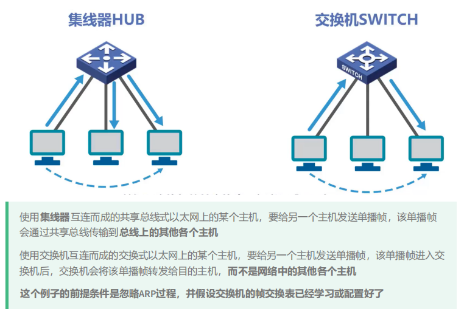

##### 交换机在链路层扩展以太网

- 以太网交换机通常都有多个接口。每个接口都可以直接与一台主机或另一个以太网交换机相连。一般都工作在全双工方式。
- 以太网交换机具有并行性，能同时连通多对接口，使多对主机能同时通信，无碰撞(不使用CSMA/CD协议)
- 以太网交换机一般都具有多种速率的接口，例如:10Mb/s、100Mb/s、1Gb/s、10Gb/s接口的多种组合。
- 以太网交换机工作在数据链路层（也包括物理层)，它收到帧后，在帧交换表中查找帧的目的MAC地址所对应的接口号，然后通过该接口转发帧。
- 以太网交换机是一种即插即用设备，其内部的帧交换表是通过自学习算法自动地逐渐建立起来的。  
- 帧的两种转发方式:
    1. 存储转发
    2. 直通交换:采用基于硬件的交叉矩阵(交换时延非常小，但 不检查帧是否右差错)

##### 交换机自学习和转发帧流程

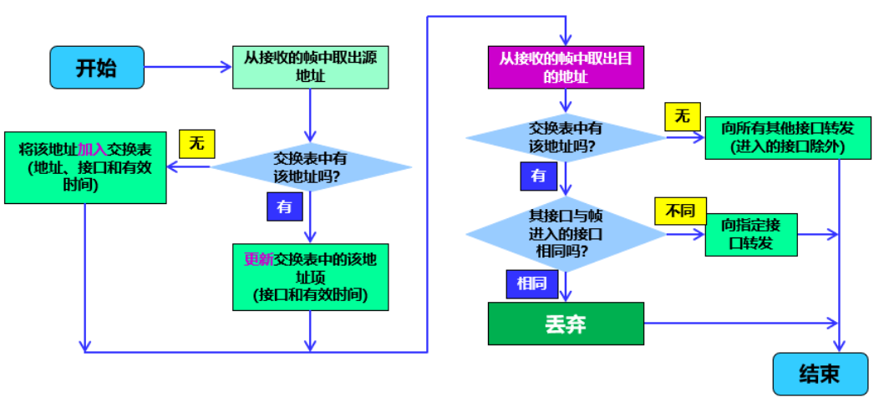

1. 收到帧后进行登记。登记的内容为帧的源MAC地址及进入交换机的接口号;
2. 根据帧的目的MAC地址和交换机的帧交换表对帧进行转发，有以下三种情况:
    - 明确转发:交换机知道应当从哪个（或哪些）接口转发该帧（单播，多播，广播)
    - 盲目转发:交换机不知道应当从哪个端口转发帧，只能将其通过除进入交换机的接口外的其他所有接口转发（也称为泛洪)。
    - 明确丢弃:交换机知道不应该转发该帧，将其丢弃。

- 帧交换表中的每条记录都有自己的有效时间，到期删除。原因如下:
  - 交换机的接口改接了另一台主机;
  - 主机更换了网卡。

##### 以太网交换机的生成树协议STP

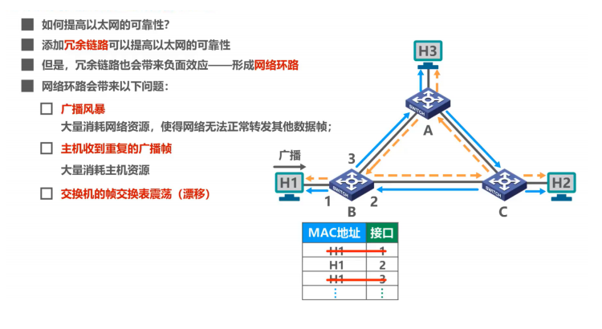

###### 生成数协议STP

- 以太网交换机使用生成树协议STP(Spanning Tree Protocol),可以在增加冗余链路来提高网络可靠性的同时又避免网络环路带来的各种问题。
  - 不论交换机之间采用怎样的物理连接，交换机都能够自动计算并构建一个逻辑上没有环路的网络，其逻辑拓扑结构必须是树型的(无逻辑环路);
  - 最终生成的树型逻辑拓扑要确保连通整个网络;
  - 当首次连接交换机或网络物理拓扑发生变化时(有可能是人为改变或故障)，交换机都将进行生成树的重新计算。

#### 虚拟局域网VLAN

##### 虚拟局域网VLAN概述

- 以太网交换机工作在数据链路层（也包括物理层)
- 使用一个或多个以太网交换机互连起来的交换式以太网，其所有站点都属于同一个广播域。
- 随着交换式以太网规模的扩大，广播域相应扩大。
- 巨大的广播域会带来很多弊端:广播风暴难以管理和维护―潜在的安全问题
- 网络中会频繁出现广播信息（TCP/IP协议栈中很多协议都会使用广播，例如ARP、RIP、DHCP等)
- 分割广播域的方法:使用路由器可以隔离广播域，但路由器成本较高，虚拟局域网VLAN技术应运而生。

##### 概念

虚拟局域网VLAN(Virtual Local Area Network)是一种将局域网内的设备划分成与物理位置无关的逻辑组的技术，这些逻辑组具有某些共同的需求。
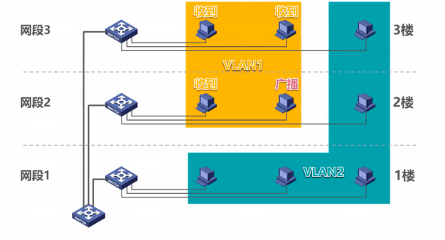

- 利用以太网交换机可以很方便地实现虚拟局域网VLAN (Virtual LAN)。
- IEEE 802.1Q对虚拟局域网VLAN的定义:
    -**虚拟局域网**VLAN是由一些局域网网段构成的**与物理位置无关的逻辑组**，而这些网段具有某些共同的需求。每一个VLAN的帧都有一个明确的标识符，指明发送这个帧的计算机是属于哪一个VLAN。
  - 同一个VLAN内部可以广播通信，不同VLAN不可以广播通信
  - **虚拟局域网其实只是局域网给用户提供的一种服务，而并不是一种新型局域网**。
  - 由于虚拟局域网是用户和网络资源的逻辑组合，因此可按照需要将有关设备和资源非常方便地重新组合，使用户从不同的服务器或数据库中存取所需的资源。
