[toc]

# 网络层

## 网络层概述

- 网络层的主要任务是**实现网络互联**，进而**实现数据包在网络间之间的传输**
- 要实现网络层的任务，则需要解决一下主要问题
  - 网络层向运输层提供怎样的服务（**可靠传输**还是**不可靠传输**）
  - 网络层寻址问题
  - 路由选择问题
- 因特网（internet）是目前全世界用户数量最多的互联网，它使用**TCP/IP**协议栈
- 由于**TCP/IP**协议栈的网络层使用**网际协议IP**，它是整个协议栈的核心协议，因此在TCP/IP协议栈中网络层通常被称为**网际层**

## 网络层提供的两种服务

### 面向连接的虚电路服务

- **可靠通信由网络来保证**
- 必须建立**网络层的连接---虚电路VC**（Virtual Circuit）
- 通信双方**沿着已建立的虚电路发送分组**

### 无连接的数据报服务

- **可靠通信有主机来保证**
- **不需要建立网络层连接**
- **每个分组可走不同路径**
- 每个分组的**首部必须携带目的主机的完整地址**
- 这种通信方式所传送的**分组可能误码，丢失，重复和时序**

### 网络层的两个层面

在路由器之间传送的信息有一下两大类：

- 转发源主机和目的主机之间所传送的**数据**
- **传送路由信息** （是根据路由算法导出为转发分组而用的转发表）

因此，网络层可抽象为**数据层面**和**控制层面**

## 网际协议 IP

### IP地址

#### 概述

- **IPv4地址**就是给英特网上的**每一台主机（或路由器）的每一个接口**分配一个在全世界范围内是一个**唯一的32比特的标识符**
- IP地址由英特网名字和数字分配机构**ICANN**进行分配
- IPv4地址使用**点分10进制表示方法**以方便用户使用

#### 分类的IP地址

- A类地址

  

  最小网络号0，保留不指派

  第一个可指派的网络号为1，网络地址为 1.0.0.0

  最大网络号为 127，作为本地回环测试，不指派

  范围 0 - 127， 可指派的网络数量 = 2^(8-1) - 2 = 126

- B类地址

  

  最小网络号为128.0，其网络地址为128.0.0.0

  最大网络号也是最后一个可指派网络号为191.255， 其网络地址为191.255.0.0

  可分配范围 128 - 191， 可指派网络数量 = 2^(16-2)

- C类地址

  
  最小网络号192.0.0，其网络地址为 192.0.0.0

  最大网络号也是最后一个可指派网络号为223.255.255，其网络地址为223.255.255.0

  可分配范围 192 - 223, 可指派的网络地址数量 = 2^(24 - 3 )

- D类地址

  多播地址，该地址前缀为1110

  可分配范围 224 - 239

- E类地址

  保留地址，该地址前缀为1111
  
  不可被分配， 范围 240 - 255

**私有地址：**

- 10.0.0.0/8
- 172.16.0.0/12
- 192.168.0.0/16

## RIP协议

### 概述

- 路由信息协议RIP(Routing Information Protocol)是内部网关协议IGP中最先得到广泛使用的协议之一
- RIP要求自治系统AS内的每一个路由器都要维护从它自己到AS内其他每一个网络的距离记录。这是一组距离，称为“距离向量"
- RIP使用跳数(Hop Count)作为度量(Metric)来衡量到达目的网络的距离。
  - 路由器到直连网络的距离定义为1。
  - 路由器到非直连网络的距离定义为所经过的路由器数加1。
  - 允许一条路径最多只能包含15个路由器。“距离”等于16时相当于不可达。因此，RIP只适用于小型互联网

### RIP协议的工作过程

- 路由器刚开始工作时，只知道自己到直连网络的距离为1。
- 每个路由器仅和相邻路由器周期性地交换并更新路由信息。
- 若干次交换和更新后，每个路由器都知道到达本AS内各网络的最短距离和下一跳地址，称为收敛。

### RIP协议的路由条目的更新规则

- 发现了新的网络，添加
- 到达目的网络，相同下一跳，最新消息，更新
- 到达目的网络，不同下一跳，新路由优势，更新
- 到达目的网络，不同下一跳，新路由劣势，不更新
- 到达目的网络，不同下一跳，等价负载均衡

### RIP协议存在“坏消息”传得慢的问题

- “坏消息传播得慢”又称为路由环路或距离无穷计数问题，这是距离向量算法的一个固有问题。可以采取多种措施减少出现该问题的概率或减小该问题带来的危害。
  - 限制最大路径距离为15(16表示不可达)
  - 当路由表发生变化时就立即发送更新报文（即“触发更新”)，而不仅是周期性发送
  - 让路由器记录收到某特定路由信息的接口，而不让同一路由信息再通过此接口向反方向传送(即“水平分割"

## 开放最短路径优先OSPF协议

### 概述

- 开放最短路径优先OSPF(Open Shortest Path First)，是为克服RIP的缺点在1989年开发出来的。
  - “开放”表明OSPF协议不是受某一家厂商控制，而是公开发表的。
  - “最短路径优先”是因为使用了Dijkstra提出的最短路径算法SPF。
- OSPF是基于链路状态的，而不像RIP那样是基于距离向量的。
- OSPF采用SPF(最短路径优先)算法计算路由，从算法上保证了不会产生路由环路。
- OSPF不限制网络规模，更新效率高，收敛速度快。
- 链路状态是指本路由器都和哪些路由器相邻，以及相应链路的“代价”(cost)。
  - “代价”用来表示费用、距离、时延、带宽，等等。这些都由网络管理人员来决定。
- 使用OSPF的每个路由器都会产生链路状态通告LSA

###  开放最短路径优先OSPF的基本工作原理

- OSPF相邻路由器之间通过交互问候(Hello)分组，建立和维护邻居关系。
  - Hello分组封装在IP数据报中，发往组播地址224.0.0.5;
  
  - 发送周期为10秒
  - 40秒未收到来自邻居路由器的hello分组，则认为该邻居路由器不可达
  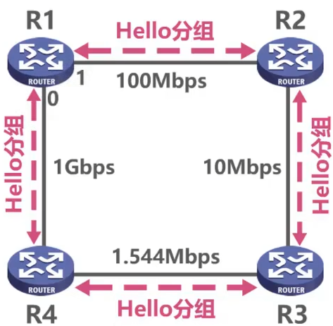
  

### 链路状态通告

- 使用OSPF的每个路由器都会产生链路状态通告LSA(Link State Advertisement)。LSA中包含以下内容:
  - 直连网络的链路状态信息
  - 邻居路由器的链路状态信息
  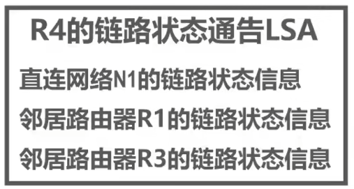
- LSA被封装在链路状态更新分组LSU中，采用洪泛法发送。
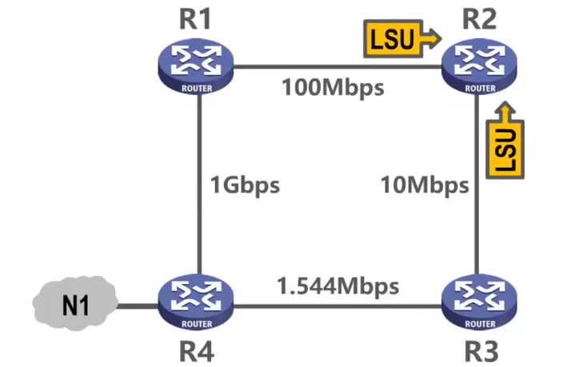
- 使用OSPF的每个路由器都有一个链路状态数据库LSDB，用于存储LSA.
- 通过各路由器洪泛发送封装有自己LSA的LSU分组，各路由器的LSDB最终将达到一致。
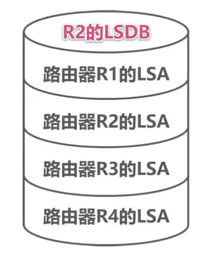

- OSPF有以下五种分组类型
  - 类型1，问候(Hello)分组: 用来发现和维护邻居路由器的可达性。
  - 类型2，数据库描述(Database Description)分组: 向邻居路由器给出自己的链路状态数据库中的所有链路状态项目的摘要信息
  - 类型3，链路状态请求(Link State Request)分组: 向邻居路由器请求发送某些链路状态项目的详细信息。
  - 类型4，链路状态更新(Link State Update)分组: 路由器使用这种分组将其链路状态进行洪泛发送，即用洪泛法对全网更新链路状态。
  - 类型5，链路状态确认(Link State Acknowledgment)分组: 这是对链路状态更新分组的确认分组。

### OSPF基本工作过程

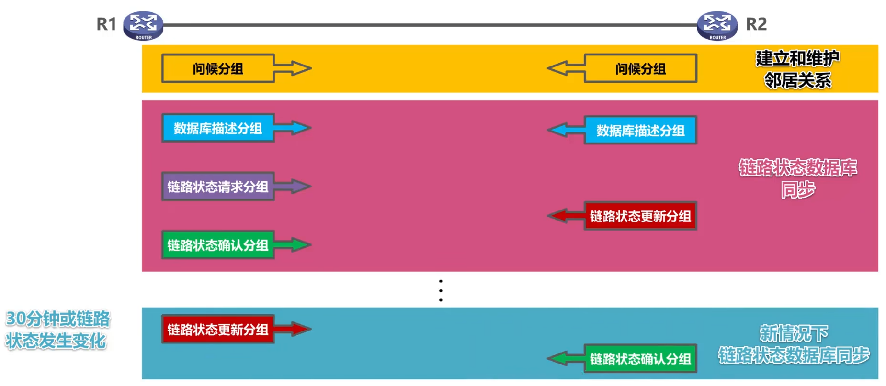

### OSPF在多点接入网络中路由器邻居关系的建立

- 链路状态确认(Link State Acknowledgment)分组
- 选举指定路由器DR(designated router)和备用的指定路由器BDR(backup designated router)
- 所有的非DR/BDR只与DR/BDR建立邻居关系
- 非DR/BDR之间通过DR/BDR交换信息

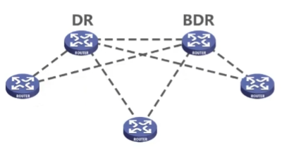

## 边界网关协议GBP协议

### 概念

- 因特网采用分层次的路由选择协议
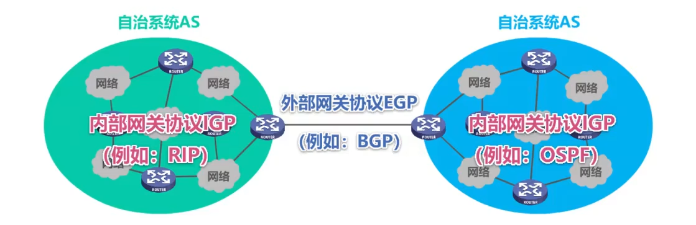
- 内部网关协议IGP(例如路由信息协议RIP或开放最短路径优先OSPF
  - 设法使分组在一个自治系统内尽可能有效地从源网络传输到目的网络
  - 无需考虑自治系统外部其他方面的策略
- 外部网关协议EGP(例如边界网关协议BGP)
  - 在不同自治系统内，度量路由的“代价”(距离，带宽，费用等)可能不同。因此，对于自治系统之间的路由选择，使用“代价”作为度量来寻找最佳路由是不行的。
  - 自治系统之间的路由选择必须考虑相关策略（政治，经济，安全等)
  - BGP只能是力求寻找一条能够到达目的网络且比较好的路由（不能兜圈子)，而并非要寻找一条最佳路由

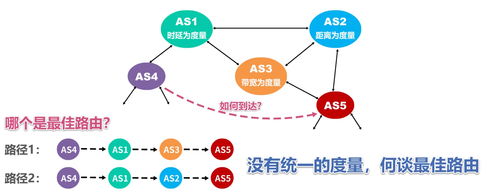

### 边界网关协议BGP的基本工作原理

- 在配置BGP时，每个自治系统的管理员要选择至少一个路由器作为该自治系统的“BGP发言人”
- 不同自治系统的BGP发言人要交换路由信息，首先必须建立TCP连接端口号为179
  - 在此TCP连接上交换BGP报文以建立BGP会话
  - 利用BGP会话交换路由信息（例如，增加新的路由，或撤销过时的路由，以及报告出错的情况等)
  - 使用TCP连接交换路由信息的两个BGP发言人，彼此称为对方的邻站(neighbor)或对等站(peer)
- BGP发言人除了运行BGP外，还必须运行自己所在自治系统所使用的内部网关协议IGP，例如OSPF或RIP。
- BGP发言人交换网络可达性的信息（要到达某个网络所要经过的一系列自治系统)
- 当BGP发言人互相交换了网络可达性的信息后，各BGP发言人就根据所采用的策略从收到的路由信息中找出到达各自治系统的较好的路由。也就是构造出树形结构、不存在回路的自治系统连通图。

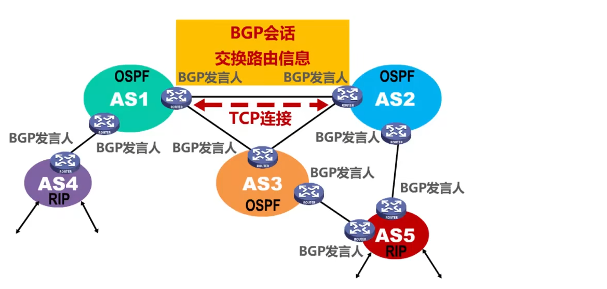

### BGP的4种报文

- OPEN(打开)报文:用来与相邻的另一个BGP发言人建立关系，使通信初始化。
- UPDATE(更新)报文:用来通告某一路由的信息，以及列出要撤销的多条路由。
- KEEPALIVE(保活)报文:用来周期性地证实邻站的连通性。
- NOTIFICATION(通知)报文:用来发送检测到的差错。

## IP数据报首部格式

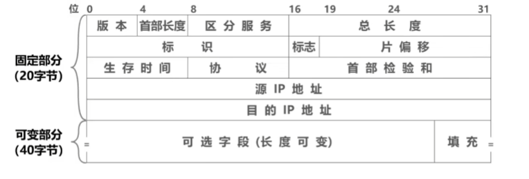

### 概述

## 网际控制协议ICMP

### 概念

- 为了更有效地转发IP数据报和提高交付成功的机会，在网际层使用了网际控制报文协议ICMP(Internet Control Message Protocol)。
- 主机或路由器使用ICMP来发送**差错报告报文**和**询问报文**
- **ICMP报文被封装在IP数据报**中发送

### ICMP差错报告报文

**ICMP差错报告报文共有以下五种:**

- 终点不可达
  - 当路由器或主机不能交付数据报时，就向源点发送终点不可达报文。具体可再根据ICMP的代码字段细分为目的网络不可达、目的主机不可达、目的协议不可达、目的端口不可达、目的网络未知、目的主机未知等13种错误。
  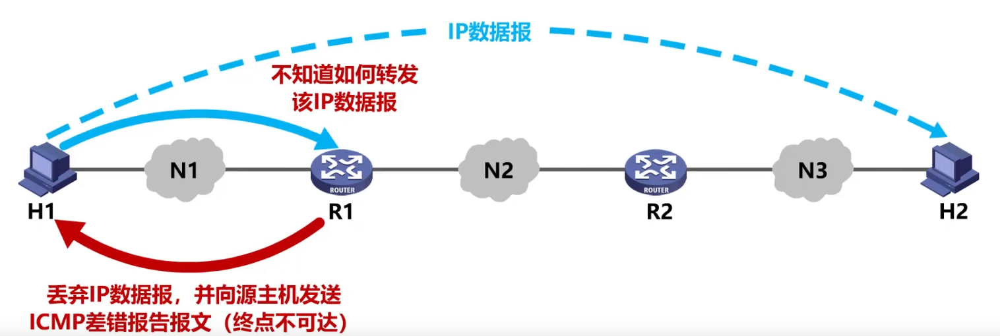
- 源点抑制
  - 当路由器或主机由于拥塞而丢弃数据报时，就向源点发送源点抑制报文,使源点知道应当把数据报的发送速率放慢。
  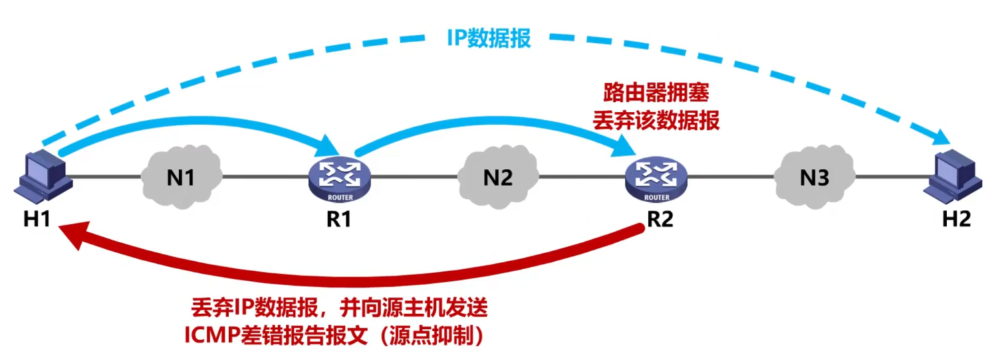
- 时间超过
  - 当路由器收到一个目的IP地址不是自己的IP数据报，会将其生存时间TTL字段的值减1。
  - 若结果不为0，则将该IP数据报转发出去;若结果为0，除丢弃该IP数据报外，还要向源点发送时间超过报文。
  - 另外，当终点在预先规定的时间内不能收到一个数据报的全部数据报片时就把已收到的数据报片都丢弃，也会向源点发送时间超过报文。
  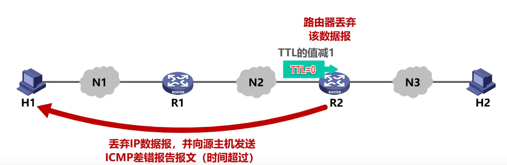
- 参数问题
  - 当路由器或目的主机收到IP数据报后，根据其首部中的检验和字段发现首部在传输过程中出现了误码，就丢弃该数据报，并向源点发送参数问题报文。
  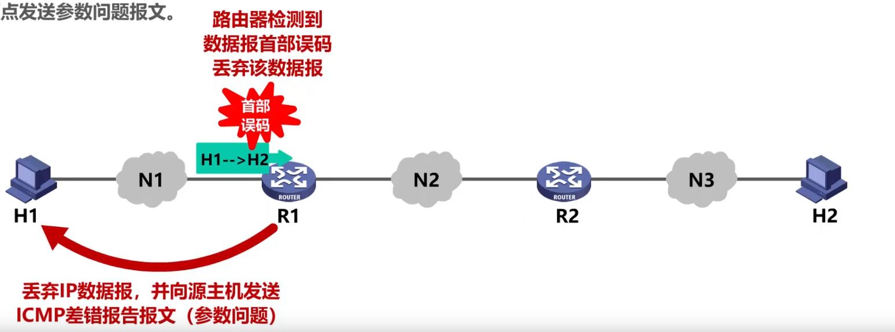
- 改变路由
  - 路由器把改变路由报文发送给主机，让主机知道下次应将数据报发送给另外的路由器(可通过更好的路由)。
  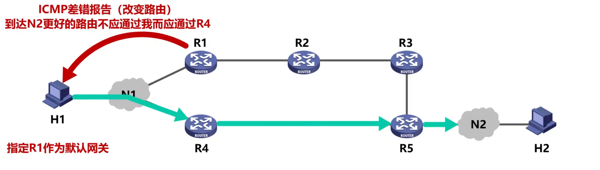

**以下情况不应发送ICMP差错报告报文:**

- 对ICMP差错报告报文不再发送ICMP差错报告报文
- 对第一个分片的数据报片的所有后续数据报片都不发送ICMP差错报告报文
- 对具有多播地址的数据报都不发送ICMP差错报告报文
- 对具有特殊地址(如127.0.0.0或0.0.0.0)的数据报不发送ICMP差错报告报文

### ICMP询问报文

**常用的ICMP询问报文有一下两种：**

- 回送请求和回答
  -ICMP回送请求报文是由主机或路由器向一个特定的目的主机发出的询问。收到此报文的主机必须给源主机或路由器发送ICMP回送回答报文。这种询问报文用来**测试目的站是否可达**及了解其有关状态。
- 时间戳请求报文和回答
  - ICMP时间戳请求报文是请某个主机或路由器回答当前的日期和时间。
  - 在ICMP时间戳回答报文中有一个32位的字段，其中写入的整数代表从1900年1月1日起到当前时刻一共有多少秒。
  - 这种询问报文用来**进行时钟同步和测量时间**

### ICMP应用举例

**分组网间探测（PING）.**

- 用来测试主机或路由器间的连通性
- 应用层直接使用网际层的ICMP(没有通过运输层的TCP或UDP)
- 使用ICMP回送请求和回答报文

**跟踪路由（traceroute）.**

- 用来测试IP数据报从源主机到达目的主机要经过哪些路由器
- Windows版本
  - tracert命令
  - 应用层直接使用网际层ICMP
  - 使用了ICMP回送请求和回答报文以及差错报告报文
- Unix版本
  - traceroute命令
  - 在运输层使用UDP协议
  - 仅使用ICMP差错报告报文

## 专用虚拟网络VPN与网络地址转换NAT

### 虚拟专用网VPN(Virtual Private Network)

**利用公用的因特网作为本机构各专用网之间的通信载体，这样的专用网又称为虚拟专用网。**
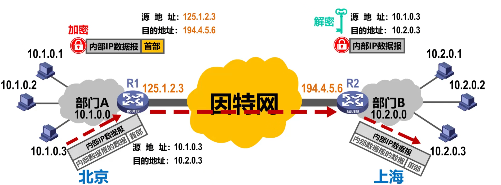

### 网络地址转换NAT(Network Address Translation)

虽然因特网采用了无分类编址方式来减缓IPv4地址空间耗尽的速度，但由于因特网用户数目的激增，特别是大量小型办公室网络和家庭网络接入因特网的需求不断增加，IPv4地址空间即将面临耗尽的危险仍然没有被解除。

1994年提出了一种网络地址转换NAT的方法再次缓解了IPv4地址空间即将耗尽的问题

NAT能使大量使用内部专用地址的专用网络用户共享少量外部全球地址来访问因特网上的主机和资源。

- 由于绝大多数的网络应用都是使用运输层协议TCP或UDP来传送数据,因此可以利用运输层的端口号和IP地址一起进行转换。这样，**用一个全球IP地址就可以使多个拥有本地地址的主机同时和因特网上的主机进行通信**。这种将端口号和IP地址一起进行转换的技术叫作**网络地址与端口号转换NAPT**(Network Address and Port Translation)。
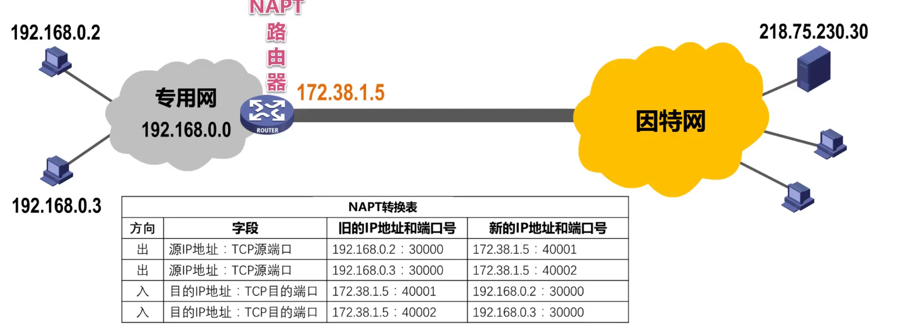
