# 运输层

## 运输层概述

- 之前课程所介绍的计算机网络体系结构中的物理层、数据链路层以及网络层它们共同解决了将主机通过异构网络互联起来所面临的问题，实现了主机到主机的通信。
- 但实际上在计算机网络中进行通信的真正实体是位于通信两端主机中的进程。
- 如何为运行在不同主机上的应用进程提供直接的通信服务是运输层的任务，运输层协议又称为端到端协议。
- 运输层直接为应用进程间的逻辑通信提供服务

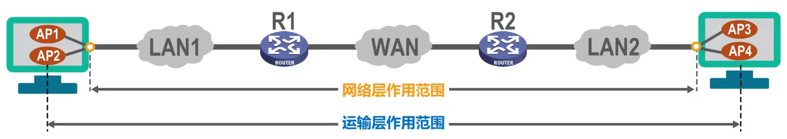

## 运输层端口号，复用与分用的概念

### 端口号

- 运行在计算机上的进程使用进程标识符PID来标志。
- 因特网上的计算机并不是使用统一的操作系统，不同的操作系统(windows，Linux，Mac OS)又使用不同格式的进程标识符。
- 为了使运行不同操作系统的计算机的应用进程之间能够进行网络通信
就必须使用统一的方法对
TCP/IP体系的应用进程进行标识。
- TCP/IP体系的运输层使用端口号来区分应用层的不同应用进程。
  - 端口号使用**16比特**表示，取值范围**0~65535**;
    - **熟知端口号**:0~1023，IANA把这些端口号指派给了TCP/IP体系中最重要的一些应用协议，例如:FTP使用21/20，HTTP使用80，DNS使用53。
    - **登记端口号**:1024~49151，为没有熟知端口号的应用程序使用。使用这类端口号必须在IANA按照规定的手续登记，以防止重复。例如:Microsoft RDP微软远程桌面使用的端口是3389。
    - **短暂端口号**: 49152~65535，留给客户进程选择暂时使用。当服务器进程收到客户进程的报文时，就知道了客户进程所使用的动态端口号。通信结束后，这个端口号可供其他客户进程以后使用。
  - **端口号只具有本地意义**，即端口号只是为了标识本计算机应用层中的各进程，在因特网中,不同计算机中的相同端口号是没有联系的。

### 复用与分用

- 发送方的复用和接收方的分用（复用就是打包过程，分用就是解包）
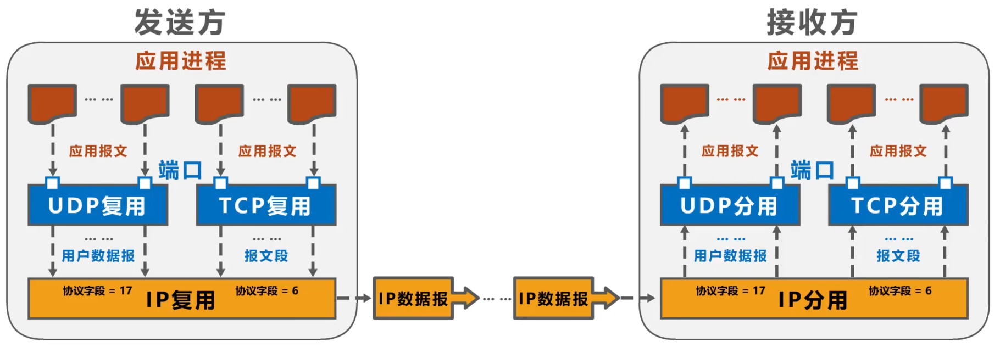
- TCP/IP体系的应用层常用协议所使用的运输层熟知端口号
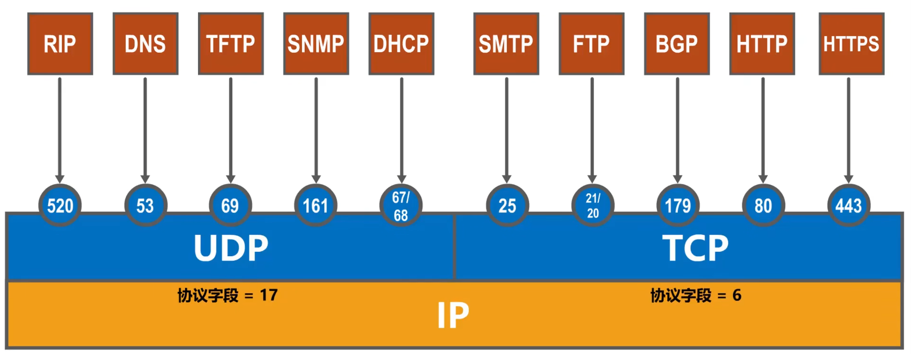

## UDP和TCP的对比

- 连接方式
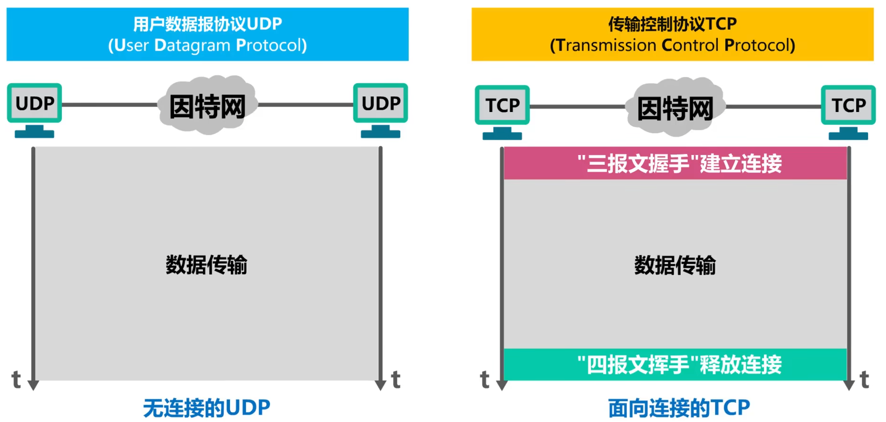
- 通信方式
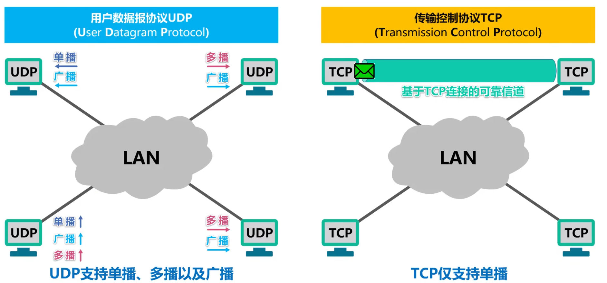
- 传输方式
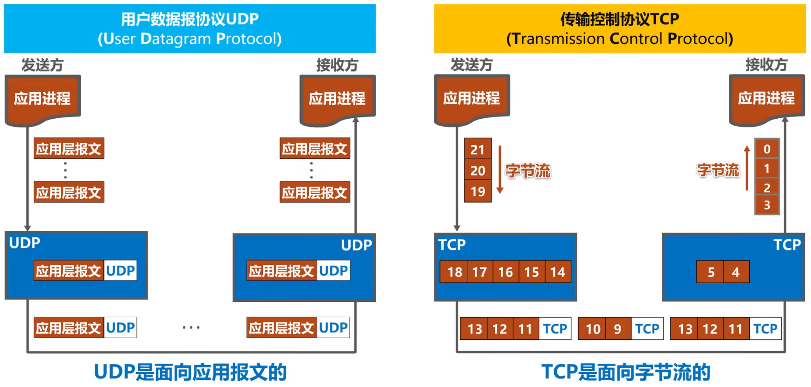
- 应用场景
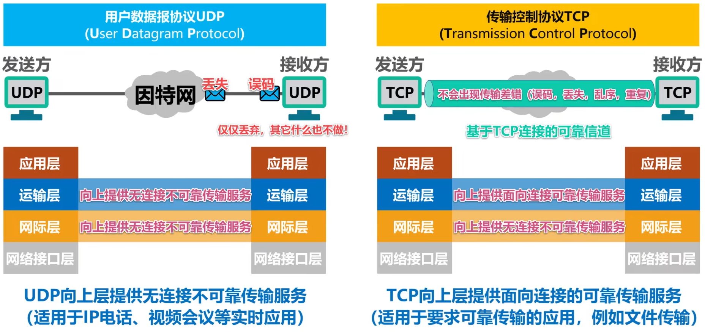
- 报文格式
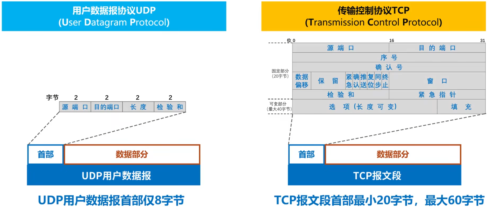

- 总结

| 用户数据报协议UDP(User Datagram Protocol)                    | 传输控制协议TCP(Transmission Control Protocol)    |
| ------------------------------------------------------------ | ------------------------------------------------- |
| 无连接                                                       | 面向连接                                          |
| 支持一对一，一对多，多对一和多对多互交通信                   | 每一条TCP连接只能有两个端点EP，只能是一对一通信。 |
| 对应用层交付的报文直接打包                                   | 面向字节流                                        |
| 尽最大努力交付，也就是不可靠;不使用流量控制和拥塞控制。  尽最大努力交付，也就是不可靠；不使用流量控制和拥塞控制. | 可靠传输，使用流量控制和拥塞控制。                |
| 首部开销小，仅8字节                                          | 首部最小20字节，最大60字节                        |

### TCP的流量控制

- —般来说，我们总是希望数据传输得更快一些
  - 但如果发送方把数据发送得过快，接收方就可能来不及接收，这就会造成数据的丢失。
- 所谓流量控制（flow control)就是**让发送方的发送速率不要太快，要让接收方来得及接收**。
- 利用**滑动窗口**机制可以很方便地在TCP连接上实现对发送方的流量控制。
  - TCP接收方利用自己的**接收窗口**的大小来限制发送方**发送窗口**的大小。
  - TCP发送方收到接收方的**零窗口通知**后，应启动持续计时器。持续计时器超时后，向接收方发送**零窗口探测报文**。
  - 发送**零窗口探测报文**后,会重新启动计时器。持续计时器超时后，再次向接收方发送**零窗口探测报文**。
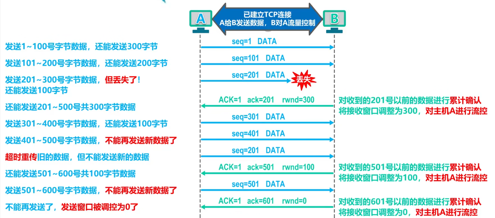
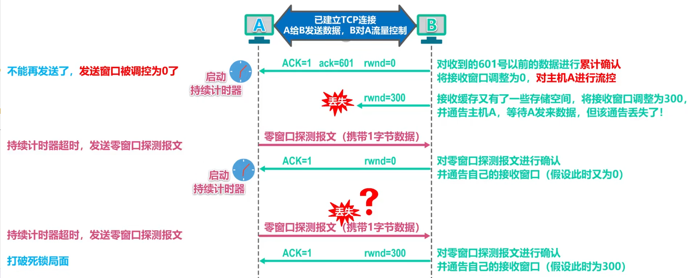

### TCP拥塞控制

#### 概念

- 在某段时间，若对网络中某一资源的需求超过了该资源所能提供的可用部分，网络性能就要变坏。这种情况就叫做拥塞(congestion)。
  - 在计算机网络中的链路容量（即带宽)、交换结点中的缓存和处理机等，都是网络的资源
- 若出现拥塞而不进行控制，整个网络的吞吐量将随输入负荷的增大而下降。
- 真正的发送窗口值 = min(接收窗口值，拥塞窗口值)
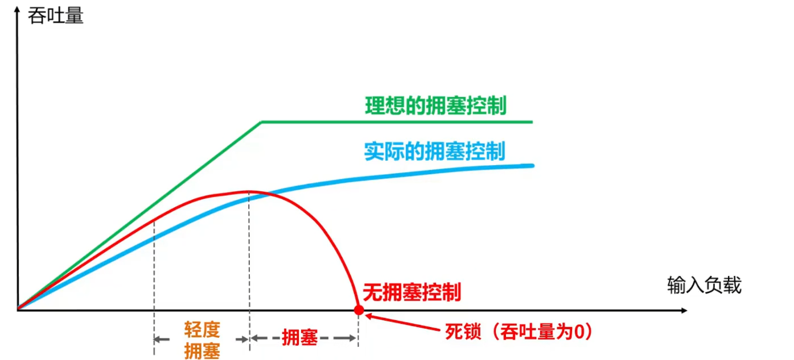

#### TCP的四种拥塞控制算法

- 发送方维护一个叫做拥塞窗口cwnd的状态变量，其值取决于网络的拥塞程度，并且动态变化。
  - 拥塞窗口cwnd的维护原则:**只要网络没有出现拥塞，拥塞窗口就再增大一些;但只要网络出现拥塞，拥塞窗口就减少一些**。
  - 判断出现网络拥塞的依据:没有按时收到应当到达的确认报文(即发生超时重传)。
- 发送方将拥塞窗口作为发送窗口swnd，即swnd = cwnd。维护一个慢开始门限ssthresh状态变量:
  - 当cwnd < ssthresh时，使用**慢开始算法**;
  - 当cwnd > ssthresh时，停止使用慢开始算法而改用**拥塞避免算法**;
  - 当cwnd = ssthresh时，既可使用慢开始算法，也可使用拥塞避免算法。

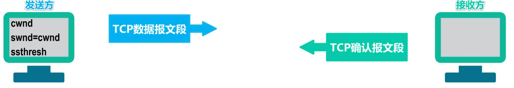

##### 慢开始 (slow-start)

- 目的：用来确定网络的负载能力或拥塞程度
- 算法的思路：由小到大逐渐增大拥塞窗口的值
- 两个变量
  - 拥塞窗口（cwnd）:初始拥塞窗口值： 2种设置方法。窗口值逐渐增大
    - 1至2个最大报文段（就标准）
    - 2至4个最大报文段（RFC 5681）
  - 慢开始门限（ssthresh）:防止拥塞窗口过大引起网络拥塞

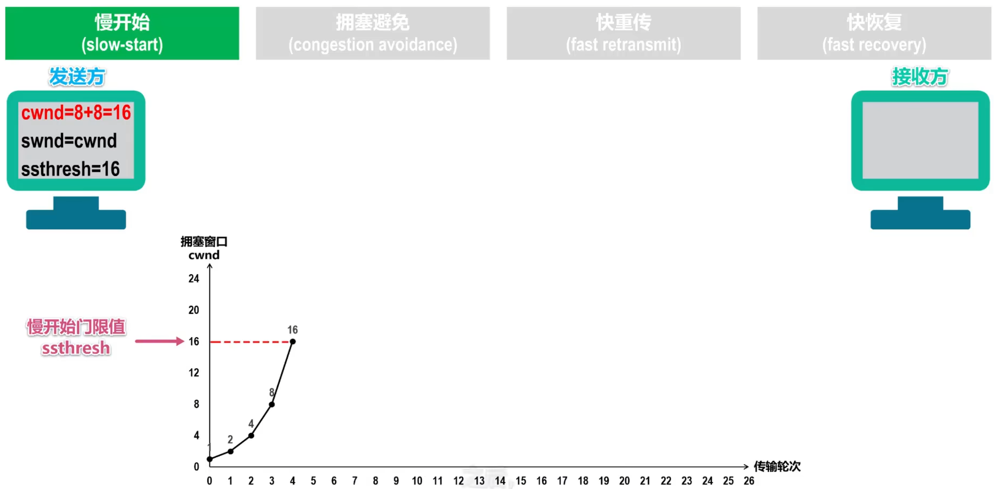
图中纵坐标值是拥塞窗口

每经过一个传输轮次。拥塞窗口就加倍

窗口大小按**指数增加**，

##### 拥基避免 (congestion avoidance)

- 思路：让拥塞窗口cwnd**缓慢地增大**，避免出现拥塞
- 每经过一个传输轮次，拥塞窗口 cwnd = cwnd + 1。
- 使拥塞窗口 cwnd 按线性规律缓慢增长。
- 在拥塞避免阶段，具有 “加法增大” (Additive Increase) 的特点。

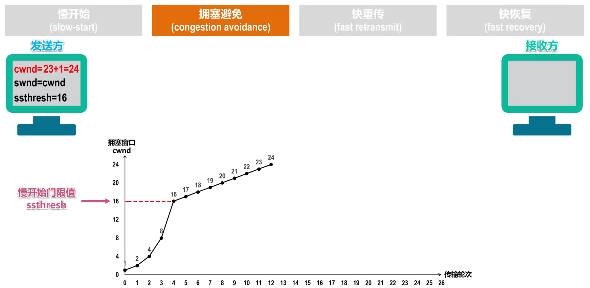

如果在发送过程中出现部分报文丢失，这必然会造成发送方对这些丢失报文段的超时重传

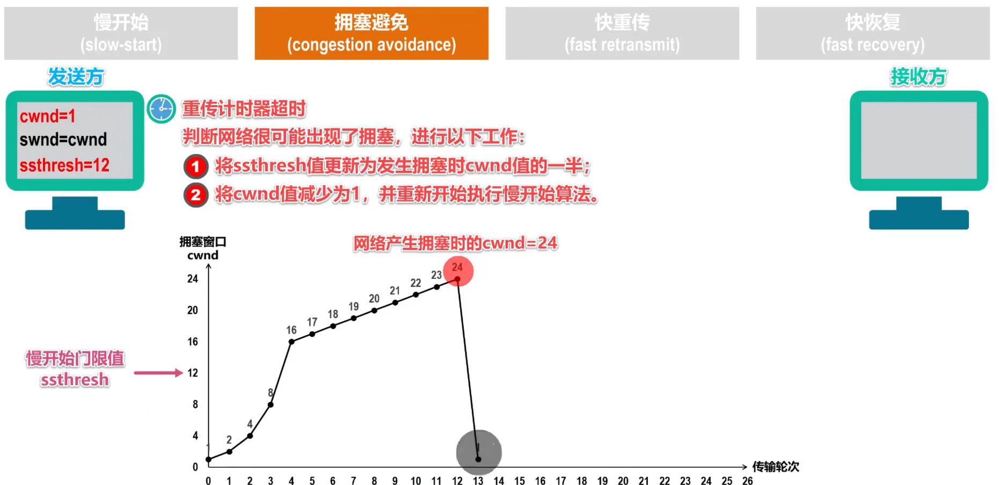

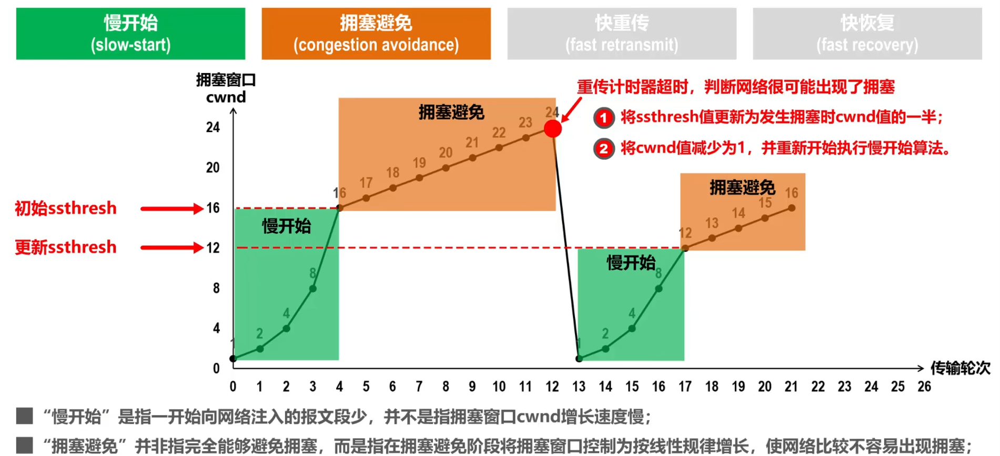

##### 快重传 (fast retransmit) 快恢复 (fast recovery)

- 概念
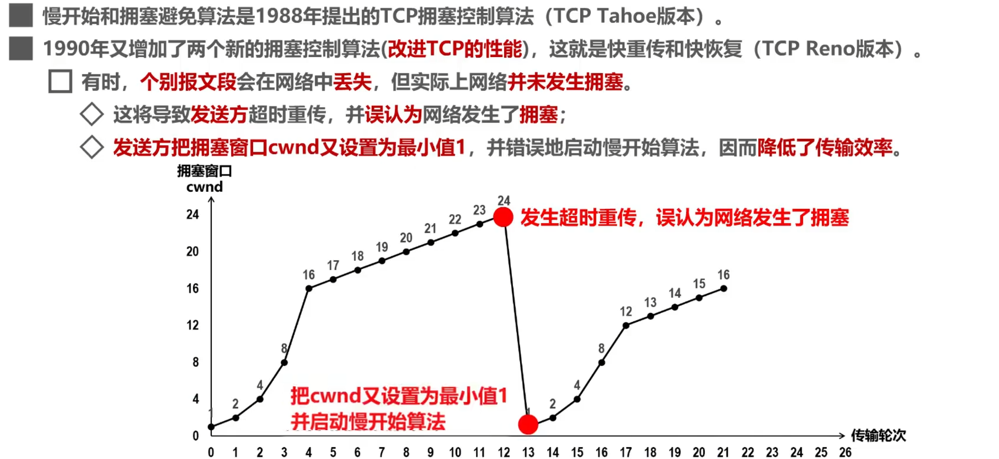

- 快重传 (fast retransmit)
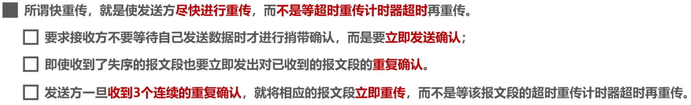
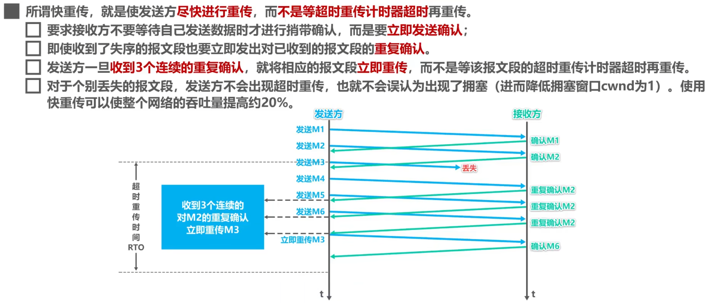

- 快恢复
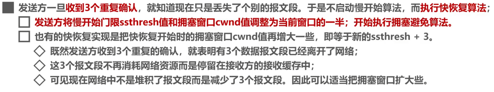

**改进后的整体算法示意图.**

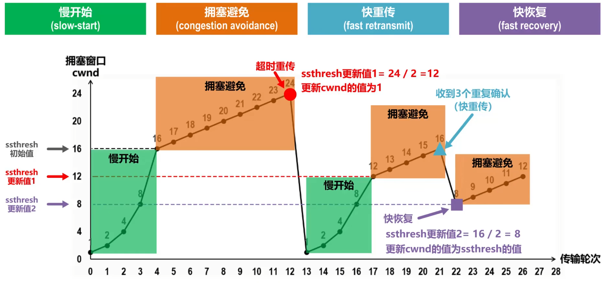

### TCP超时重传时间的选择

### TCP可靠传输实现

### TCP的运输连接管理

### TCP报文段的首部格式
